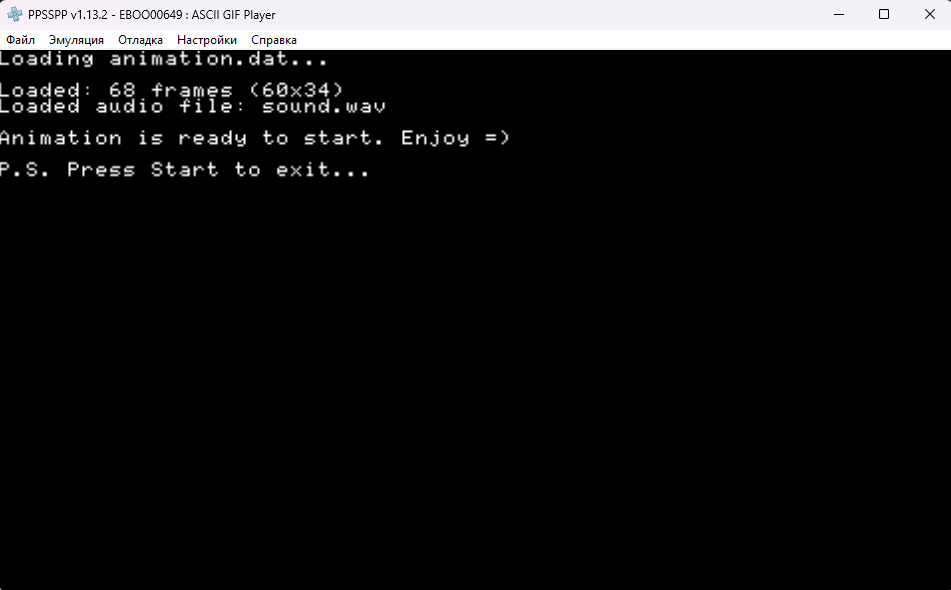

# PSP ASCII GIF Player




## Как собрать?
1. Установите PSPSDK как [указано в инструкции](https://pspdev.github.io/installation.html).
2. Склонируйте в целевую папку репозиторий при помощи команды:
```bash
git clone https://github.com/r3trob0y/psp-ascii-gif-player
```
3. Откройте в терминале папку репозитория и запустите сборку:
```bash
make clean && make
```

## Как скачать самую актуальную версию без сборки?
В репозитории уже лежит собранная версия, пользуйтесь =)

## Установка
Скопируйте папку с исполняемым файлом EBOOT.PBP в PSP/GAME

## Использование
1. Запустите converter.exe, выберите .gif и аудиофайлы
2. Поместите animation.dat, sound.wav, config.ini файлы в папку с плеером, рядом с EBOOT.PBP файлом
3. Запустите =)

# ТЕХНИЧЕСКАЯ ИНФОРМАЦИЯ

## Конфиг `config.ini`, описание

```ini
[Animation]
File = animation.dat # Путь к файлу с анимацией

[Audio]
File = sound.wav # Путь к аудиофайлу
Volume = 100 # Громкость

[Display]
FrameDelay = 3  # Меньше = быстрее
Loop = 1        # 1 - зациклить, 0 - проиграть анимацию один раз
```

## **Формат .dat файла:**
```
[Header - 8 bytes]
- frame_count: 4 bytes
- width:       2 bytes
- height:      2 bytes

[Data]
- Кадры последовательно
- Каждая строка → null-терминатор
```